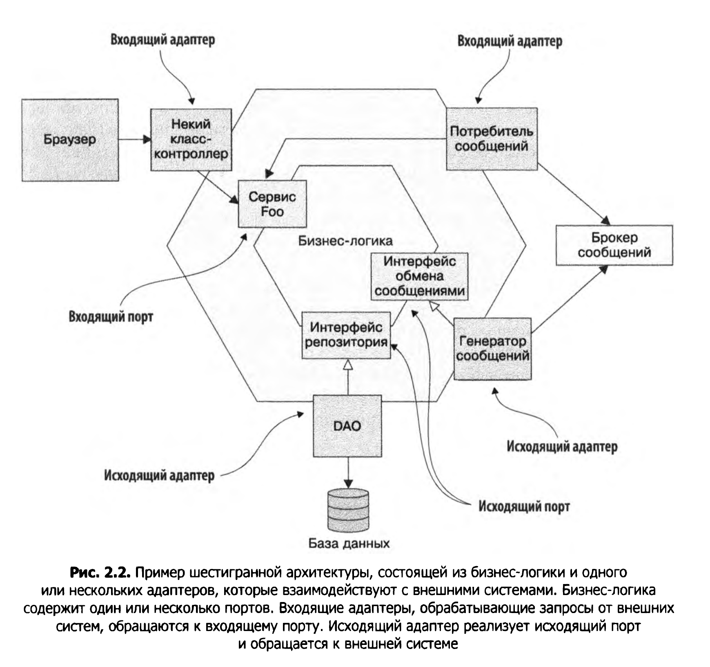

# Архитектура приложения
* Архитектура приложения - это его декомпозиция (разбиение) на части и связи между ними.
* Модель представлений архитектуры 4+1

  Архитектуру здания можно рассматривать с разных точек зрения (представлений) - например каркас, водопровод, электропроводка и тп.  
  Аналогично с архитектурой приложения:
  1. Логическое представление - классы, пакеты и связи между ними.
  2. Представление реализации - что получается в результате сборки (EAR,WAR,JAR) и связи м\у ними.
  3. Представление процесса - компоненты на этапе выполнения. Каждый элемент представляется процессом, связи между ними - IPC.
  4. Представление развернтывания - как процессы распределены по устройствам. Элемент - сервер и процесс, связи - сеть.
  
  Сценарии (+1 в модели 4+1) описывают как элементы внутри каждого представления взаимодействуют между собой чтобы обработать запрос.
  
 

* Требования к приложению делятся на 2 категории:
  1. Функциональные требования - приложение должно реализовывать необходимые пользовательские истории т.е. иметь нужный функционал.
  Архитектура приложения не играет сдесь большой роли, можно реализовать нужный функционал и с плохой архитектурой.
  2. Качественные требования - надежность, масштабируемость, тестируемость, возможность доработки и тп. В этом случае архитектура
  играет важную роль.
* О: Архитектурный стиль определяет структуру системы, в частности набор компонентов и коннекторов допустимых в рамках этого стиля
и правила, по которым они могут сочетаться.
##### Архитектурные стили (логическое представление)
* Многоуровневый архитектурный стиль.
  Програмные элементы распределяются по уровням, уровни слабо связаны между собой. П: трехуровневая архитектура:
  1. Уровень представления - содержит код для отрисовки интерфейса или внешнего АПИ (контроллер).
  2. Уровень бизнес-логики (сервис).
  3. Уровень хранения данных (репозиторий).
  Недостатки:единый уровень представления, единый уровень хранения данных (скорее всего только одна бд), бизнес-логика зависит от уровня
  хранения данных.
* Шестигранный архитектурный стиль.
  Бизнес-логика помещается в центр шестиугольника и окружается адаптерами.
  1. Уровень представления заменен на один или более входящих адаптеров.
  2. Уровень хранения данных заменен на один или более исходящих адаптеров.
  Ключевое приемущество: бизнес-логика отделена от слоя представления и от слоя доступа к данным через адаптеры.

* О: Порт определяет то как бизнес-логика взаимодействует с внешним кодом (чаще всего это интерфейс). 
Бывают входящие и исходящие порты.
  * О: Входящий порт - это АПИ, выставляемое бизнес-логикой наружу (например интерфейс сервиса).
  * О: Исходящий порт определяет то, как бизнес-логика обращается к внешнему коду (П: интерфейс репозитория).
* Вокруг бизнес логики располагаются адаптеры.
  * Входящий адаптер - принимает запросы извне и обращается к входящему порту (П:контроллер).
  * Исходящий адаптер реализует интерфейс исходящего порта (П: реализация репозитория)
##### Архитектурные стили (представление реализации)
1. Монолитный стиль - приложение реализовано в виде единого исполняемого компонента (war,jar,ear).
2. Микросервисный стиль - приложение реализовано в виде набора слабо связанных компонентов.
* О: Сервис - это автономный, независимо развертываемый програмный компонент реализующий определенные функции.

* О: Слабая связанность - сервисы взаимодействуют только через апи, общих БД нет.
##### Определение микросервисной архитектуры приложения

1. Определить системные операции. Системная опреация - это запрос, который приложение должно выполнить исходя из требований бизнеса.
  
  Доменная модель составляется в основном из имен существительных, взятых из пользовательских историй, а системные операции — в основном из глаголов.
2. Разбить приложение на сервисы.
3. Описать АПИ каждого сервиса: назначить всему набору сервисов все системные операции и определить как сервисы будут взаимодействовать между собой.
##### Разбиение на сервисы используя DDD
* О: Domain-Driven Design (DDD, предметно-ориентированное проектирование) проектирование управляемое предметной областью (решаемой задачей).
