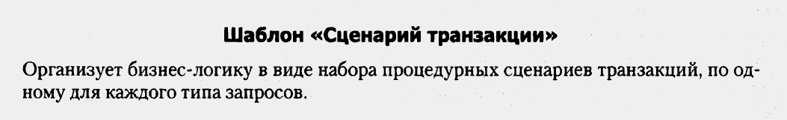
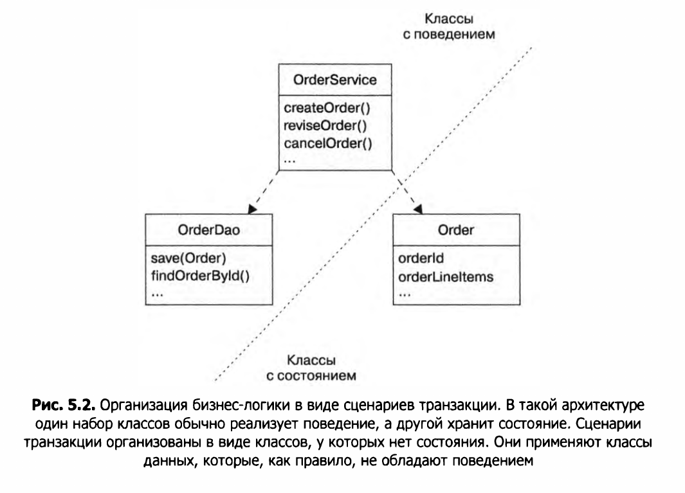
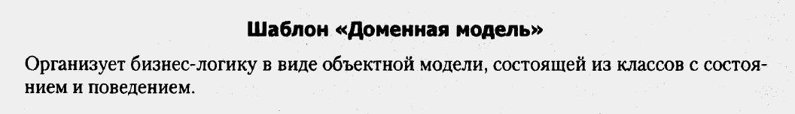
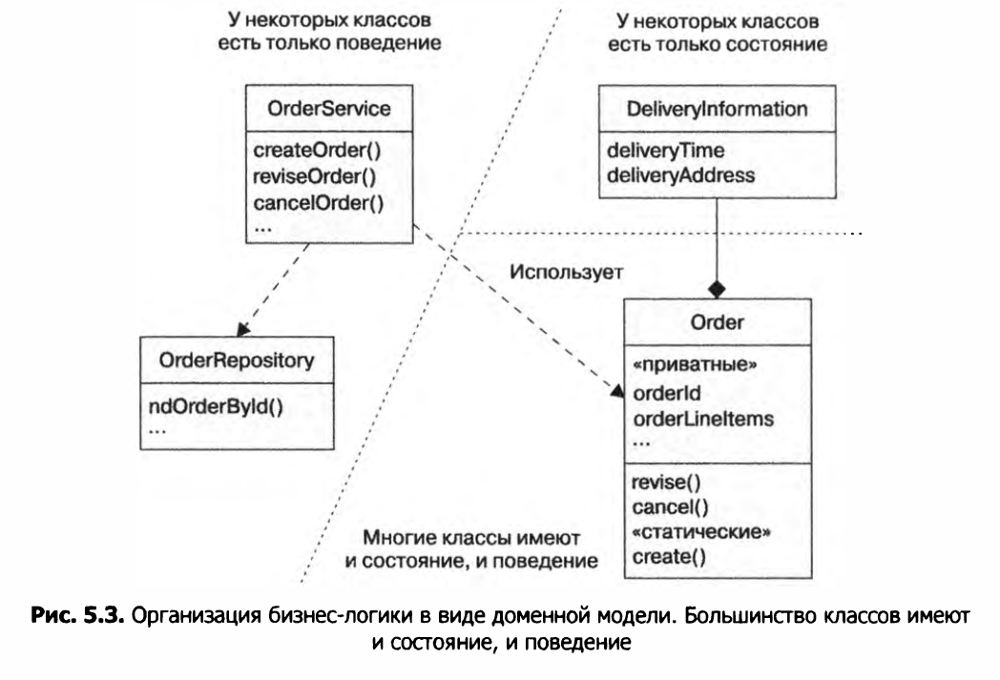
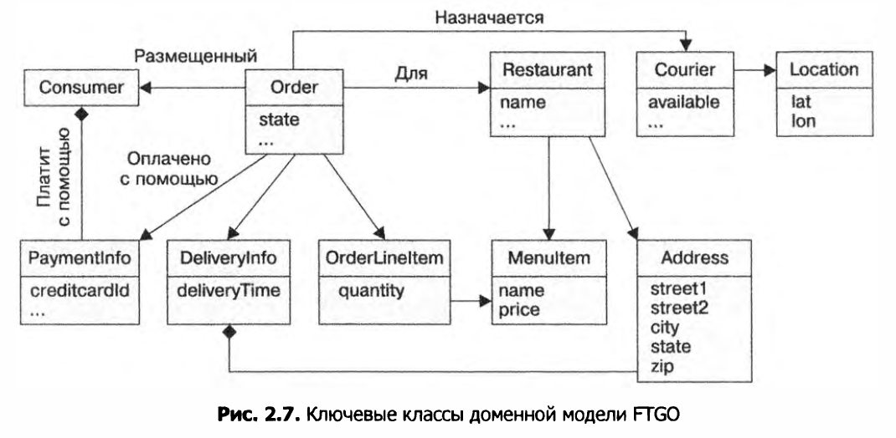
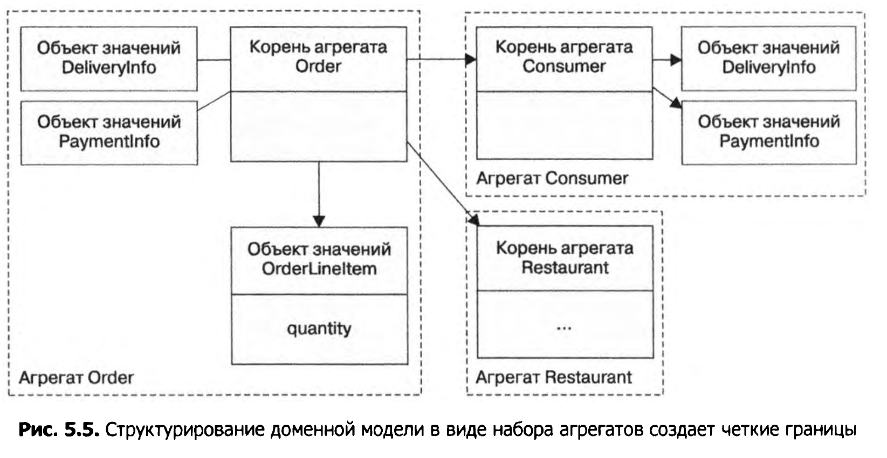
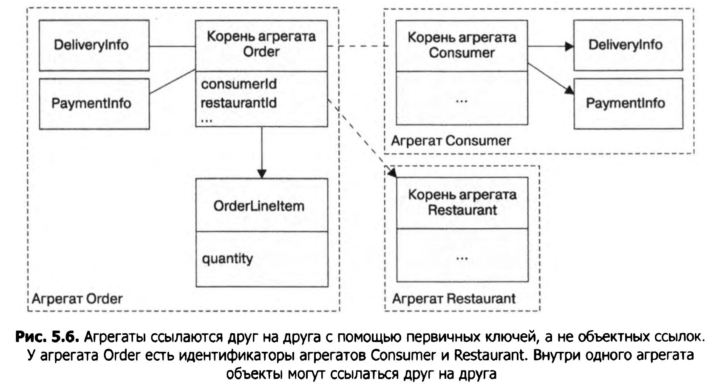
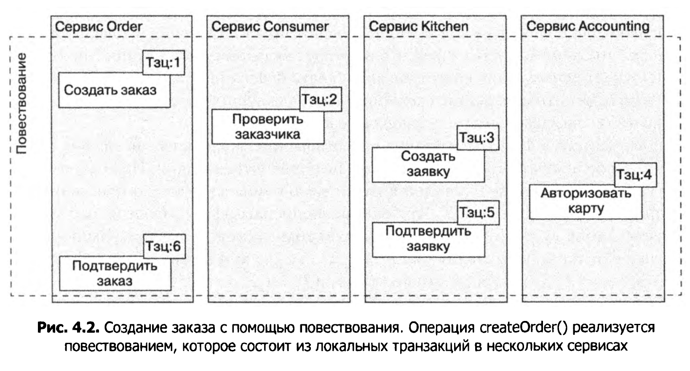
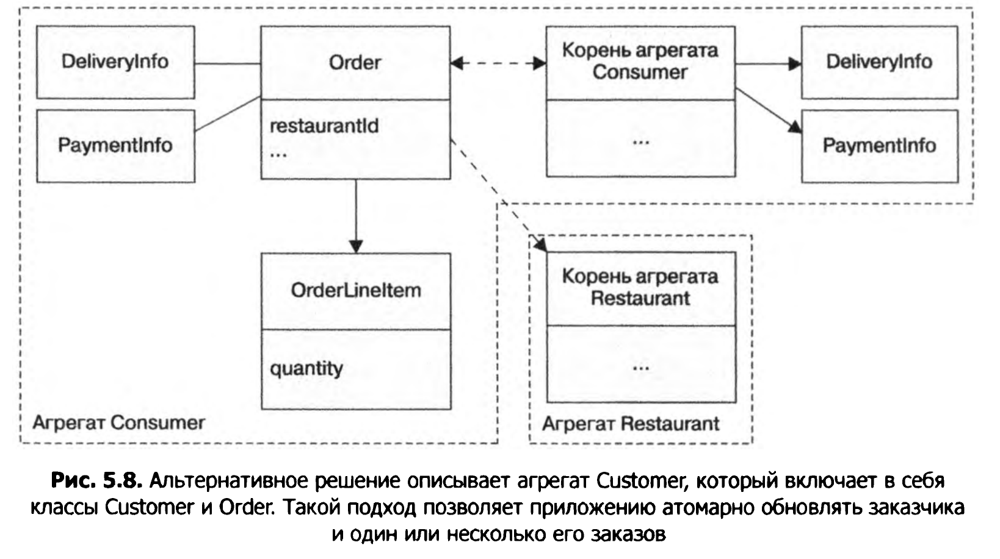
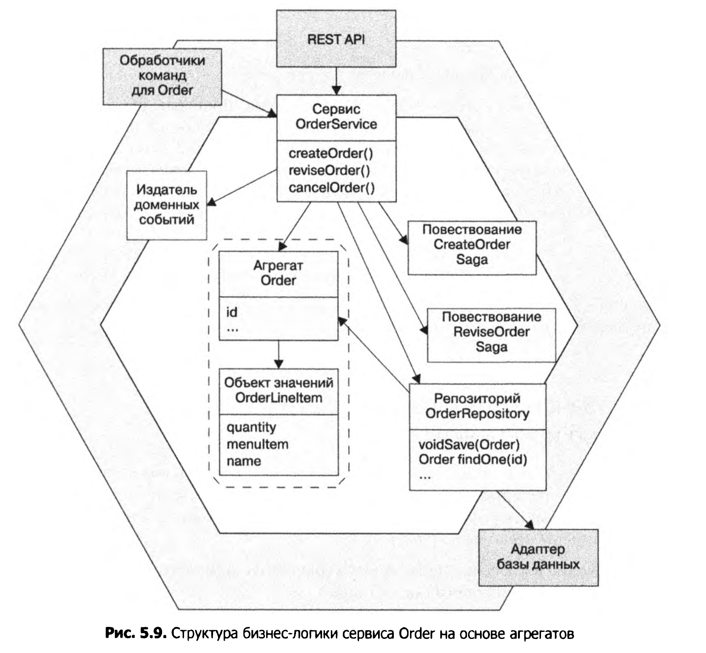

# Проектирование бизнес-логики в микросервисной архитектуре

### Сценарий странзакции (Transaction script)(шаблон) 

* Контекст применения: бизнес-логика относительно проста.
* В рамках этого шаблона на каждый внешний или системный вызов создается отдельный метод
(сценарий транзакции). Сценарии транзакции обычно располагаются в сервисе, который использует
шаблон DAO и класс сущьности для осуществления операций с БД.
* Классы разделены на 2 группы:
  + Классы, содержащие поведение (не содержат состояния) - OrderService,OrderDAO.
  + Классы, содержащие состояние (не содержат поведения) - классы сущностей (Order).
  

### Доменная модель (модель предметной области) (шаблон)

* Domain = предметная область.

* Контекс применения: сложная бизнес-логика.
* В рамках этого шаблона класс Order имеет состояние и поведение. Благодаря этому
методы OrderService становится более простым. Упрощение отдельных классов облегчает
написание юнит-тестов и понимание модели классов вцелом.

* Доменная модель создается с помощью стандартных методик, таких как анализ
имен существительных в пользовательских историях. П: <b>Клиент</b> размещает <b>заказ</b>.
* Доменная модель (модель предметной области) содержит в себе классы, описывающие
реальные объекты. П:
  
 
### Предметно-ориентированное проектирование (Domain-Driven Design,DDD)

* Агрегаты разбивают доменную модель на блоки, в которых легче разобраться
по отдельности. Они также проясняют область применения операций, таких как
загрузка, обновление и удаление. Эти операции распространяются на весь агрегат,
а не на какие-то его части. Агрегат часто загружается из базы данных целиком, что
позволяет избежать любых проблем с ленивой загрузкой. Вместе с агрегатом из базы
данных удаляются все его объекты.

* О: Domain-Driven Design (DDD, предметно-ориентированное проектирование) проектирование управляемое предметной областью (решаемой задачей). Это специализированный вариант Domain Model.
* Стратегические шаблоны (шаблоны уровня всего приложения): 
  1. Поддомены (subdomains). Domain - это предметная область, в рамках которой мы решаем задачи. Поддомен - это часть этой проблемы (П: область - пицца, поддомены - готовка,доставка,биллинг).
  2. Изолированный контекст (bounded context) - это область применения доменной модели (часть доменной модели). Для разных сервисов и поддменов доменная модель может быть разной 
  (П: order в доставка и биллинг может быть различен).
* Тактические шаблоны (более мелкие строительные блоки):
  1. Сущность (entity) — объект, обладающий устойчивой идентичностью. Две сущности, чьи атрибуты имеют одинаковые значения (но разные первичные ключи), — это все равно разные объекты. 
  2. Объект значений (value object) — объект, представляющий собой набор значений. Два объекта значений с одинаковыми атрибутами взаимозаменяемы. Примером таких объ­ектов может служить класс Money, 
  который состоит из валюты и суммы.
  3. Фабрика (factory) — объект или метод, реализующий логику создания объектов, которую ввиду ее сложности не следует размещать прямо в конструкторе. Фабрика также может скрывать конкретные классы, 
  экземпляры которых создает. Она реализу­ ется в виде статического метода или класса.
  4. Репозиторий — объект, предоставляющий доступ к постоянным сущностям и инкапсулирующий механизм доступа к базе данных.
  5. Сервис — объект, реализующий бизнес-логику, которой не место внутри сущности или объекта значений.
* О: Агрегат - это граф доменных объектов имеющий один корень (root element), с ним можно обращаться как с единым целым. Объекты агрегата доступны только через корень.
* Причины того, что агрегаты удобны при разработке микросервисной архитектуры:
  + Ссылка между агрегатами это просто значение первичного ключа (а не сам объект) =>
  ссылки на объекты не выходят за рамки одного сервиса.
  + Транзакция обновляет лишь один агрегат => транзакции не выходятза рамки одного 
  сервиса. 
* О: Инварианты - это бизнес-правила, которые всегда должны соблюдаться (П:минимальная сумма заказа).
* Правила для аггрегатов:
  1. Внешние классы ссылаются только на корень агрегата.
  Оно требует,чтобы корневая сущность была единственной частью агрегата, на которую могут ссылаться внешние классы. Для обновления агрегата клиенту необходимо вызвать
  метод из его корня (П: нельзя изменить отдельно OrderItem, нужно обновлять весь заказ, чтобы Order мог проверить все инварианты - напр. минимальную сумму).
  2. Межагрегатные ссылки должны применять первичные ключи (а не сами объекты).
  Правило состоит в том, что агрегаты ссылаются друг на друга по уникальному значению, например по первичному ключу, а не по объектным ссылкам. 
  На рис. 5.6  показано, как заказ ссылается на своего заказчика с помощью consumerld, а не ссылки на объект Consumer. Аналогичным образом заказ ссылается на ресторан с ис­пользованием restaurantld.
  Это позволяет четко определить границы между ними и избежать случайного обновления не того агрегата, ленивая загрузка тоже не нужна.

  3. Одна транзакция создает или обновляет один агрегат.
  Это правило хорошо подходит для микросервисной архитектуры - транзакция не покидает пределы сервиса. Согласованность данных обеспечивается через повествование. Кроме того можно использовать
  NOSQL без поддержки сложных транзакций.
  <b>О: Повествование (saga)</b> - это шаблон, при котором одна системная операция (П: создание заказа) разбивается на набор локальных транзакций, выполнение последующих транзакций 
  инициируется асинхронными сообщениями. Асинхронные сообщения снижают требования к доступности - брокер хрнаит сообщения пока потребитель сообщений не доступен.

  4. Размеры аггрегатов должны быть как можно маленькими.
  Если разные команды работают над разными аггрегатами то это уменьшает вероятность внесения конфликтующих изменений. Более мелкие аггрегаты порождают более мелкие транзакции -> скорость работы выше
  и сами микросервисы могут быть мельче.

  Преимущество этого более крупного агрегата Consumer заключается в том, что
  приложение может атомарно обновлять заказчика и один или несколько его заказов.
  Недостатком этого подхода является ухудшение масштабируемости. Транзакции,
  обновляющие разные заказы для одного клиента, будут сериализованы. К тому же,
  если два пользователя попытаются отредактировать разные заказы одного клиента,
  получится конфликт. Кроме того бизнес-логика для заказов и клиентов должна находиться в одном сервисе, что де­лает этот сервис более объемным.
### Доменные события
* О: Доменное событие - это клас с именем на основе страдательного причастия прошедшего времени (П: OrderC            reatedEvent).
* Бизнес-логика состоит из агрегата Order, класса сервиса OrderService, репо­зитория OrderRepository и одного или нескольких повествований. OrderService
обращается к OrderRepository, чтобы сохранять и загружать заказы. Если сервисполучает простые запросы, которые не выходят за его рамки, он обновляет агрегат
Order. Если запрос охватывает несколько сервисов, OrderService создает повество­вание.

* Возьмем, к примеру, агрегат Order в приложении FTGO. В число собы­тий, которые меняют его состояние, входят Order Created, Order Cancelled, Order
Shipped и т. д. При наличии заинтересованных потребителей агрегат Order может публиковать одно из этих событий в момент изменения своего состояния.

