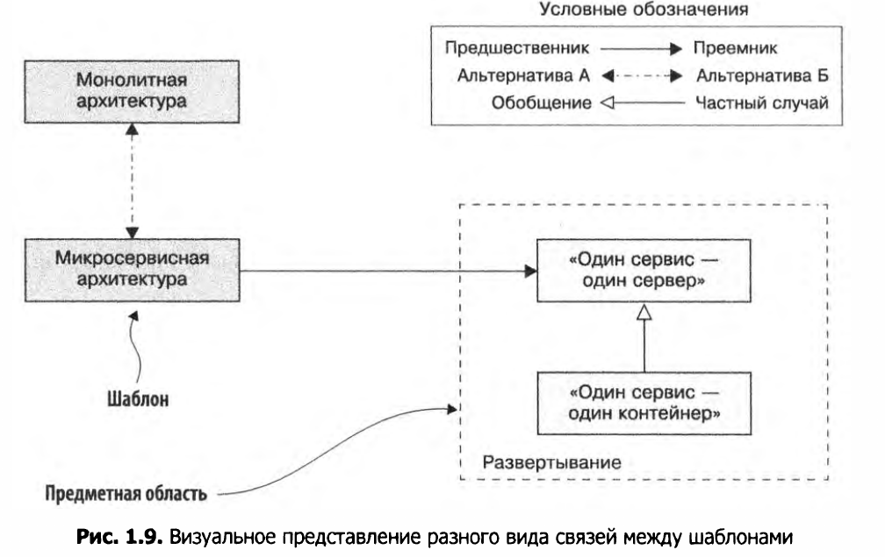
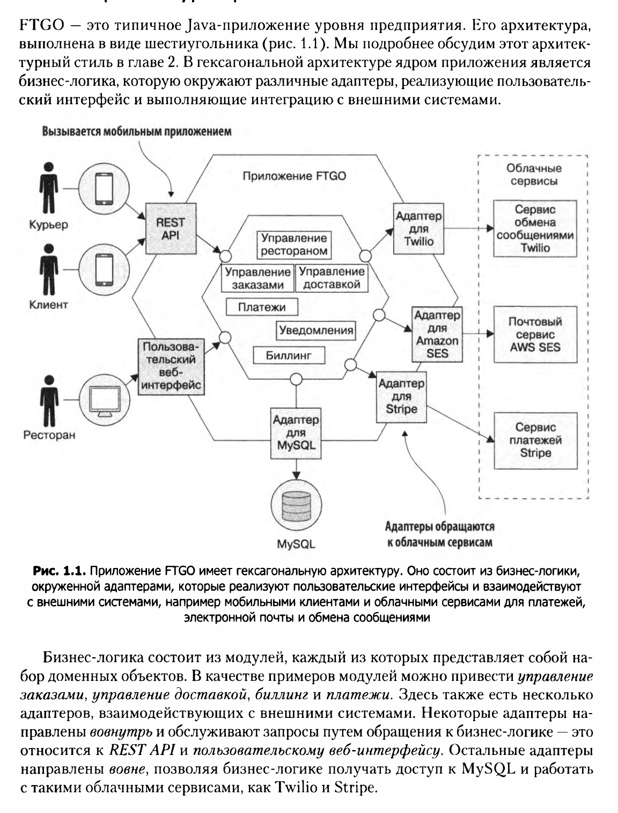
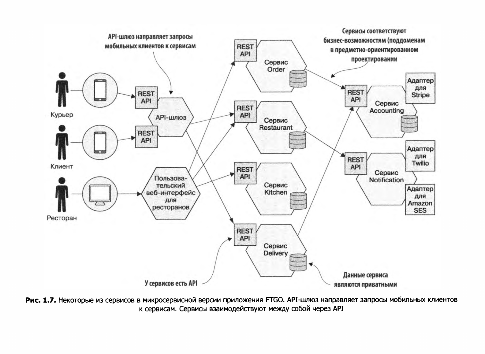
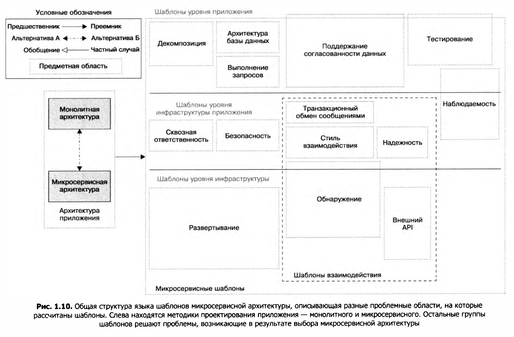
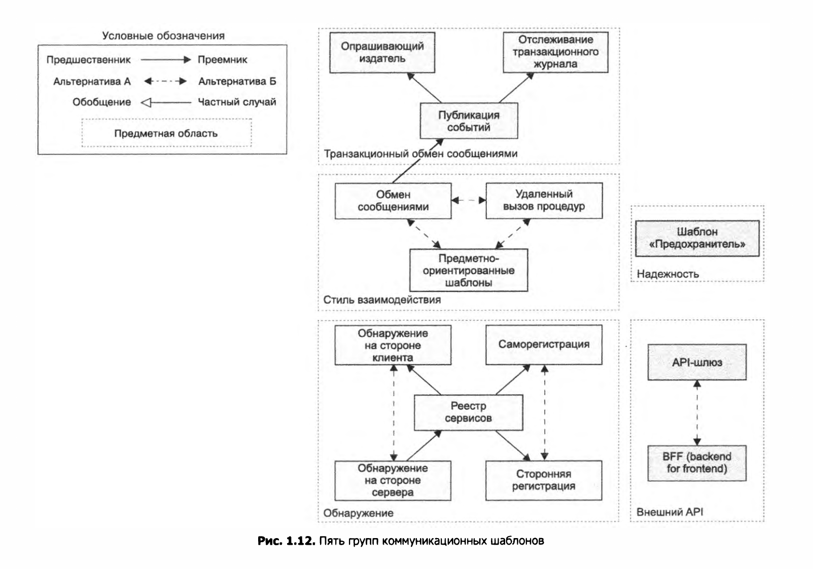

### Design Patterns
* О: Шаблон проектирования (design pattern) - это архитектурная конструкция с помощью которой можно решить определенную проблему,
возникающую в определенном контексте (ситуации).
* O: An organized collection of design patterns that relate to a particular field is called a pattern language. 
* O: Context - это диапазон ситуаций в котором может быть использован шаблон.
* O: Forces - дополнительные обстоятельства, возникающие при решении проблемы в указанном контексте (ситуации).

 П: 
 ```
 Problem: расположить окна в комнате
 Forces: в комнате должно быть достаточно светло и при этом не слишком жарко (conflicting forces)
 Solution: нужно разместить от X до Y окон
 Context: подходит для нежилых помещений определенного размера
 ```
* Составные части design pattern:
  1. Name
  2. Problem (in context) - The problem describes when to apply the pattern. It explains the problem and its context.
  3. Solution  - каким образом решается данная проблема в этом шаблоне. Решение часто содержит диаграмму классов.
  4. Consequences - последствия применения данного шаблона. приемущества и недостатки. New contexts and patterns.
* Алгоритм применения шаблона:

 ```
 IF    you find yourself in CONTEXT
       for example EXAMPLES
       with PROBLEM 
       entailing (влекущая) FORCES
 THEN  for some REASONS
       apply DESIGN FORM AND/OR RULES
       to construct SOLUTION
       leading to NEW CONTEXT and OTHER PATTERNS
 ```  
* Раздел родственные шаблоны (related patterns) описывает связь между действу­ющим и другими шаблонами проектирования.
Связь бывает пяти типов:
  1. Предшественник — предшествующий шаблон, который обосновывает потреб­
ность в данном шаблоне. Например, микросервисная архитектура — это пред­
шественник всех остальных шаблонов в языке шаблонов, кроме монолитной
архитектуры.
  2. Преемник — шаблон, который решает проблемы, порожденные данным шабло­ном.
Например, при использовании микросервисной архитектуры необходимо
применить целый ряд шаблонов-преемников, включая обнаружение сервисов
и шаблон «Предохранитель».
  3. Альтернатива — альтернативное решение по отношению к данному шаблону.
Например, монолитная и микросервисная архитектуры — это альтернативные
способы проектирования приложения. Нужно выбрать одну из них.
  4. Обобщение — обобщенное решение проблемы. Например, в главе 12 представлены
разные реализации шаблона «Один сервис — один сервер».
  5. Специализация — специализированная разновидность шаблона. Например, в гла­
ве 12 вы узнаете, что развертывание сервиса в виде контейнера — это частный
случай шаблона «Один сервис — один сервер».


### Microservices
* О: Микросервисная архитектура - это стиль проектирования, который разбивает приложение на отдельные
сервисы с разными функциями. Каждый сервис имеет четкий перечень связанных между собой обязанностей.
  * Сервисы слабо связанны между собой и взаимодействуют только через АПИ, каждый сервис имеет свою БД.
  
 
 
* Язык шаблонов микросервисной архитектуры состоит из следующих групп шаблонов:
  1. Инфраструктурные шаблоны — решают проблемы, в основном касающиеся ин­
фраструктуры и не относящиеся к разработке.
  2. Инфраструктура приложения — предназначены для инфраструктурных задач,
влияющих на разработку.
  3. Шаблоны приложения — решают проблемы, с которыми сталкиваются разработ­
чики.
 
  
* Межпроцессноне взаимодействие (Inter Process Communication - IPC) определяет то, как микросервисы взаимодействуют 
друг с другом и с внешним миром. Шаблоны, относящиеся к IPC можно разделить на 5 групп:
  1. Стиль взаимодействия. Какой механизм IPC следует использовать (какой протокол, rest или rpc и тп)?
  2. Обнаружение. Каким образом клиент сервиса узнает его IP-адрес, чтобы, напри­
мер, выполнить НТТР-запрос?
  3. Надежность. Как обеспечить надежное взаимодействие между сервисами с уче­
том того, что некоторые из них могут быть недоступны?
  4. Транзакционный обмен сообщениями. Как следует интегрировать отправку со­
общений и публикацию событий с транзакциями баз данных, которые обновляют
бизнес-информацию?
  5. Внешний API. Каким образом клиенты вашего приложения взаимодействуют
с сервисами?

 
