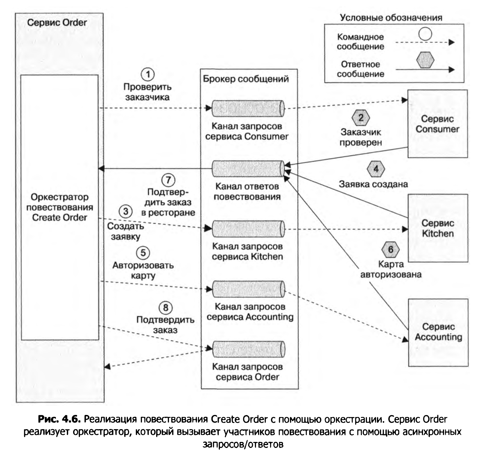

### Повествование
* О: <span style="color:blue">Повествование(saga)</span> - это шаблон, при котором одна системная операция (П: создание заказа) разбивается на набор локальных транзакций, выполнение последующих транзакций 
  инициируется асинхронными сообщениями. Повествования нужно создавать для каждой команды, которая обновляет данные в нескольких сервисах.
* Асинхронные сообщения снижают требования к доступности - брокер хрнаит сообщения пока потребитель сообщений не доступен.
  Повествование не использует распределенные транзакции.
* O: <span style="color:blue">ACID</span> -  это основное свойство транзакций - atomicy (все комманды транзакции выполняются или ни одна),consistency (согласованность,целостность данных),
  isolation, durability (долговечность данных в системе хранения). Повествованиям не хватает изолированности.


* O: <span style="color:blue">Компенсирующие транзакции</span> - это транзакции откатывающие изменения предыдущих транзакций. Пусть n+1 транзакция завершилась неудачно,T1..n это прямые транзакции, C1..n это
компенсирующие транзакции, тогда необходимо выполнить транзакции Cn..1:


* Первые три этапа повествования Create Order на­ зываются <span style="color:blue">доступными для компенсации транзакциями</span>, потому что шаги, следующие
  за ними, могут отказать. Четвертый этап называется <span style="color:blue">поворотной транзакцией</span>, по­тому что дальнейшие шаги никогда не отказывают. 
  Последние два этапа называются <span style="color:blue">доступными для повторения транзакциями</span>, потому что они всегда заканчиваются успешно.
* П: авторизация банковской карты неуспешна:
  1. Сервис Order. Создает заказ с состоянием APPROVAL-PENDING.
  2. Сервис Consumer. Проверяет, может ли заказчик размещать заказы.
  3. Сервис Kitchen. Проверяет детали заказа и создает заявку с состоянием CREATE-PENDING.
  4. Сервис Accounting. Делает неудачную попытку авторизовать банковскую карту заказчика.
  5. Сервис Kitchen. Меняет состояние заявки на CREATE_REJECTED.
  6. Сервис Order. Меняет состояние заказа на REJECTED.
* Хореография - участники сами содержат логику, которая либо продолжает сагу, либо применяет компенсирующие транзакции.  
* Оркестрация — централизация координирующей логики повествования в виде
класса-оркестратора. Оркестратор отправляет участникам повествования ко­мандные сообщения с инструкциями, какие операции нужно выполнить.


### Хореография
* Оптимистичный путь через это повествование выглядит так.
  1. Сервис Order создает заказ с состоянием APPROVAL_PENDING и публикует событие OrderCreated.
  2. Сервис Consumer потребляет событие OrderCreated, проверяет, может ли заказчик размещать заказы, и публикует событие ConsumerVerif ied.
  3. Сервис Kitchen потребляет событие OrderCreated, проверяет заказ, создает заявку с состоянием CREATE_PENDING и публикует событие TicketCreated.
  4. Сервис Accounting потребляет событие OrderCreated и создает объект СгеditCardAuthorization с состоянием PENDING.
  5. Сервис Accounting потребляет события TicketCreated и ConsumerVerif ied, выстав­ляет счет банковской карте заказчика и публикует событие CreditCardAuthorized.
  6. Сервис Kitchen потребляет событие CreditCardAuthorized и меняет состояние заявки на AWAITING_ACCEPTANCE.
  7. Сервис Order принимает события CreditCardAuthorized, меняет состояние заказа на APPROVED и публикует событие OrderApproved.

* Не удачное создание заказа (отказ в сервисе платежей):
  1. Сервис Order создает заказ с состоянием APPROVAL_PENDING и публикует событие OrderCreated.
  2. Сервис Consumer потребляет событие OrderCreated, проверяет, может ли заказчик размещать заказы, и публикует событие ConsumerVerified.
  3. Сервис Kitchen потребляет событие OrderCreated, проверяет заказ, создает заявку с состоянием CREATE_PENDING и публикует событие TicketCreated.
  4. Сервис Accounting потребляет событие OrderCreated и создает объект СгеditCardAuthorization с состоянием PENDING.
  5. Сервис Accounting потребляет события TicketCreated и ConsumerVerified, вы­ставляет счет банковской карте заказчика и публикует событие CreditCardAuthorizationFailed.
  6. Сервис Kitchen потребляет событие CreditCardAuthorizationFailed и меняет состояние заявки на REJECTED.
  7. Сервис Order потребляет событие CreditCardAuthorizationFailed и меняет со­стояние заказа на REJECTED.

* Правила хореографии:
  1. Участники повествования вонисят изменения в бд и публикуют событи я рамках одной транзакции БД.
  2. Участники повествования должны уметь сопоставлять события с записями в своих бд, например для саги создание заказа все события должны содержать orderId - 
  <span style="color:blue">идентификатор соответствия</span> :О
* Хореографи относительно проста в реализации, но код хореографии, расбросанный по сервисам сложен для понимания, возникают циклические зависимости медлу сервисами 
  (П: order-accounting-order).
  
  
### Оркестрация
* Класс-оркестратор посылает сервисам команды, в которых указывает - что нужно сделать и принимает от них асинхронные сообщения и на их основе решает, что нужно сделать дальше.
* Оптимистичный вариант:
  1. Оркестратор повествования отправляет сервису Consumer команду VerifyConsumer.
  2. Сервис Consumer возвращает в ответ сообщение ConsumerVerified.
  3. Оркестратор отправляет сервису Kitchen команду CreateTicket.
  4. Сервис Kitchen возвращает в ответ сообщение TicketCreated.
  5. Оркестратор отправляет сервису Accounting сообщение AuthorizeCard.
  6. Сервис Accounting возвращает в ответ сообщение CardAuthorized.
  7. Оркестратор отправляет сервису Kitchen команду ApproveTicket.
  8. Оркестратор отправляет сервису Order команду ApproveOrder.

* Оркестратор должен содержать в себе только логику управления последовательностью действий в рамках саги и никакой другой, иначе будет излишняя централизация
  логики в оркестраторе.
* Орекстратор следует применять для всех повествований, кроме совсем простых.
* Оркестратор удобно моделировать в виде конечного автомата.


### Нехватка изолированности в повествованиях
* О:<span style="color:blue">Аномалии</span> - это ситуации, когда результат последовательного выполнения транзакций отличается от результата их параллельного выполнения.
* Повестовования не используют распределенные транзакции следовательно возможно возникновение аномалий.
* О:<span style="color:blue">Потеря обновлений</span> - одно повествование перезаписывает изменения внесенные другим повествованием не читая их при этом.
* П: Создание заказа:
  1. Первый этап повествования Create Order создает заказ.
  2. Пока это повествование выполняется, повествование Cancel Order отменяет заказ.
  3. На завершающем этапе повествование Create Order подтверждает заказ.

  В итоге отмененный заказ будет в статусе подтвержденный.
* О:<span style="color:blue">Грязное чтение</span> - это чтение данных которые в данный момент изменяются другим повествованием.
* П: Повествование CancelOrder увеличивает доступный кредит, а повествование CreateOrder - уменьшает, тогда возможно:
  1. CancelOrder увеличивает кредит.
  2. CreateOrder уменьшает кредит.
  3. CancelOrder откатывается.
  
  В итоге получаем, что клиент превысил свой кредитный лимит.
* О:<span style="color:blue">Неповторяемое чтение</span> - одно и то же повествование читает одни и те же данные (на разных этапах) и эти данные различны (другое повествование их уже изменило).
* Контрмеры применяемые при нехватке изолированности.
  1. <span style="color:blue">Семантическая блокировка</span> — блокировка на уровне приложения.
  
   Семантическая блокировка устанавливает флаг - запись не зафиксирована и может измениться. Этот флаг либо запрещает другим повествованиям изменять эту запись, либо
   говорит о том, что запись нужно перепроверить (П.- состояния X_PENDING в ORDER:CREATION_PENDING - заказ еще не создан). Другие повествования либо сразу выбрасывают ошибку,
   либо блокируются до освобождения записи.

  2. <span style="color:blue">Коммутативные обновления</span> — проектирование операций обновления таким об­разом, чтобы их можно было выполнить в любом порядке.
  
   В качестве примера можно привести команды debit () и credit () из сервиса Accounting (если не брать во внимание проверки перерасхода средств).

  3. <span style="color:blue">Пессимистическое представление</span> — перестановка этапов повествования для минимизации бизнес-рисков.
  
      1. Сервис Order. Меняет состояние заказа на CANCELLED.  
      2. Сервис Delivery. Отменяет доставку.  
      3. Сервис Customer. Увеличивает доступный кредит (применяем с самом конце в рамках повторяемой транзакции).  

  4. <span style="color:blue">Повторное чтение значения</span> — предотвращение «грязного» чтения путем повтор­ного считывания данных. Это позволяет убедиться в их неизменности перед тем,
  как их перезаписывать (jpa - optimistic lock).
  5. <span style="color:blue">Файл версий</span> — ведение записей об обновлениях, чтобы их можно было менять местами.
  6. <span style="color:blue">По значению</span> — использование бизнес-рисков каждого запроса для динамического выбора механизма конкурентности.
  
* Транзакции, доступные для компенсации должны иметь компенсирующие транзакции. Поворотная транзакция может не иметь компенсирующей, повторяемые транзакции
не нуждаются в компенсации.


### Eventuate Tram Saga framework
* <span style="color:blue">Eventuate Tram Saga framework</span> - это фреймворк для написания оркестраторов повествований.
* OrderService и его саги:

 


* Листинг CreateOrderSaga:

```java
public class CreateOrderSaga implements SimpleSaga<CreateOrderSagaState> {
    private SagaDefinition<CreateOrderSagaState> sagaDefinition;

    public CreateOrderSaga(OrderServiceProxy orderService,
                           ConsumerServiceProxy consumerService,
                           KitchenServiceProxy kitchenService,
                           AccountingServiceProxy accountingService) {
        this.sagaDefinition =
                step()
                        .withCompensation(orderService.reject,
                                CreateOrderSagaState::makeRejectOrderCommand)
                        .step()
                        .invokeParticipant(consumerService.validateOrder,
                                CreateOrderSagaState::makeValidateOrderByConsumerCommand)
                        .step()
                        .invokeParticipant(kitchenService.create,
                                CreateOrderSagaState::makeCreateTicketCommand)
                        .onReply(CreateTicketReply.class,
                                CreateOrderSagaState::handleCreateTicketReply)
                        .withCompensation(kitchenService.cancel,
                                CreateOrderSagaState::makeCancelCreateTicketCommand)
                        .step()
                        .invokeParticipant(accountingService.authorize,
                                CreateOrderSagaState::makeAuthorizeCommand)
                        .step()
                        .invokeParticipant(kitchenService.confirmCreate,
                                CreateOrderSagaState::makeConfirmCreateTicketCommand)
                        .srep()
                        .invokeParticipant(orderService.approve,
                                CreateOrderSagaState::makeApproveOrderCommand)
                        .build();

    }

    @Override
    public SagaDefinition<CreateOrderSagaState> getSagaDefinition() {
        return sagaDefinition;
    }
}

```

* События, происходящие при создании новой саги CreateOrderSaga:
  1. OrderService создает CreateOrderSagaState.
  2. OrderService создает экземпляр саги через SagaManager.
  3. SagaManager выполняет первый шаг саги.
  4. CreateOrderSagaState вызывается чтобы сгенерировать командное сообщение.
  5. SagaManager посылает команду участнику саги (Consumer Service).
  6. SagaManager сохраняет экземпляр саги в бд.
 
 
* События, происходящие при получении сообщения от ConsumerService:
  1. Eventuate Tram вызывает SagaManager и передает ему ответ от Consumer Service.
  2. SagaManager получает экземпляр саги из БД.
  3. SagaManager выполняет следующий шаг saga definition.
  4. CreateOrderSagaState вызывается для создания командного сообщения.
  5. SagaManager посылает командное сообщение участнику саги (Kitchen Service).
  6. SagaManager обновляет инстанс саги в БД.
 


  
 
 

